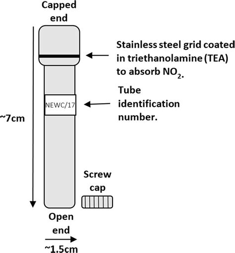

geocoder for diffusion tube locations
=====================================

Current air quality objective (AQO) = 40 micrograms per cubic metre of air (μg m-3)) (assuming this is NO2 per cubic metre (μgm-3))

World Health Organization(WHO) Air Quality Guideline (AQG) levels = 10μg m-3 (revised in September 2021)

https://lewisham.gov.uk/myservices/environment/air-pollution/read-our-air-quality-action-plan-and-other-reports
 
https://lewisham.gov.uk/-/media/air-quality-analysis.ashx

https://lewisham.gov.uk/myservices/parking/schoolstreets/schools-streets-programme-streets-outside-schools

<table>
    <tbody>
        <tr>
            <td>School</td>
            <td>Street</td>
            <td>Between
                    Junctions</td>
            <td>Operation times
            </td>
        </tr>
        <tr>
            <td>Adamsrill</td>
            <td>Adamsrill Road</td>
            <td>Fairwyn Road and Champion Road</td>
            <td>Monday-Friday 8.15-9.15 and 3.00-4.00</td>
        </tr>
        <tr>
            <td>All Saints</td>
            <td>Blackheath Vale</td>
            <td>Cul-de-sac – Entry west of Duke Humphrey Road</td>
            <td>Monday-Friday 8.15-9.00 and 3.00-4.00</td>
        </tr>
        <tr>
            <td>Ashmead</td>
            <td>Ashmead Road – One Way</td>
            <td>Westbound entry from St John’s Vale</td>
            <td>Monday-Friday 8.30-9.30 and 3.00-4.00</td>
        </tr>
        <tr>
            <td>Brindishe Green</td>
            <td>Beacon Rd &amp; Ardmere Rd</td>
            <td>Eastbound entry – from Hither Green Lane and Beacon Road and
                Ardmere Road westbound from Nightingale Grove</td>
            <td>Monday-Friday 8.30-9.30 and 2.45-3.45</td>
        </tr>
        <tr>
            <td>Conisborough College</td>
            <td>Access Road/ Thornsbeach Road</td>
            <td>Cul-de-sac – Entry south of Bellingham Road</td>
            <td>Monday-Friday 8.00-9.15 and 2.30-4.00</td>
        </tr>
        <tr>
            <td>Coopers Lane Primary</td>
            <td>Pragnell Rd</td>
            <td>Southbound entry from Kingsand Road</td>
            <td>Monday-Thursday 8.15-9.30 and 2.30-3.30 and Fri 8.15-9.30 and
                1.30-2.30</td>
        </tr>
        <tr>
            <td>Dalmain</td>
            <td>Grove Close</td>
            <td>Grove Close westbound from Brockley Rise&nbsp;</td>
            <td>Monday-Friday 8.15-9.15 and 2.30-3.30</td>
        </tr>
        <tr>
            <td>Eliot Bank</td>
            <td>Thorpewood Ave</td>
            <td>Eastbound entry from Kirkdale</td>
            <td>Monday-Friday 8.30-9.30 and 2.45-3.45</td>
        </tr>
        <tr>
            <td>Forster Park</td>
            <td>Boundfield Road</td>
            <td>Between Castillon Road &amp; Wingrove Road</td>
            <td>Monday-Thursday 8.30-9.30 and 3.00-4.00 and Fri 8.30-9.30 and
                2.00-3.00</td>
        </tr>
        <tr>
            <td>Gordonbrock</td>
            <td>Amyruth Rd</td>
            <td>Northbound entry from Chudleigh Rd</td>
            <td>Monday-Friday 8.30-9.30 and 2.45-3.45</td>
        </tr>
        <tr>
            <td>'Haberdashers' Hatcham College / Hatcham Temple Grove</td>
            <td>Pepys Road &amp; Pendrell Road</td>
            <td>Pepys Road southbound from Vesta Road, Pendrell Road
                westbound from Wallbutton Road</td>
            <td>Monday-Friday 8.00-9.15 and 2.45-3.45</td>
        </tr>
        <tr>
            <td>Haseltine</td>
            <td>Bell Green Lane</td>
            <td>Southbound entry from Stanton Way and northbound entry just
                south of Haseltine Road</td>
            <td>Monday-Friday 8.30-9.30 and 2.45-4.00</td>
        </tr>
        <tr>
            <td>Holbeach</td>
            <td>Doggett Road</td>
            <td>Holbeach Road and Bradgate Road</td>
            <td>Monday-Friday 8.15-9.30 and 2.30-3.45</td>
        </tr>
        <tr>
            <td>John Ball</td>
            <td>Baizdon Road</td>
            <td>West of Hurren Close along School frontage</td>
            <td>Monday-Friday 8.30-9.15 and 2.45-3.30</td>
        </tr>
        <tr>
            <td>Kilmorie</td>
            <td>Kilmorie Rd</td>
            <td>Northbound entry from Woolstone Rd</td>
            <td>Monday-Friday 8.15-9.15 and 2.45-3.45</td>
        </tr>
        <tr>
            <td>Marvels Lane</td>
            <td>Riddons Road</td>
            <td>Riddons Road southbound from Dyneley Road &amp; northbound
                from Claybridge Road</td>
            <td>Monday-Friday 8.30-9.30 and 2.45-3.45</td>
        </tr>
        <tr>
            <td>Myatt Garden</td>
            <td>One Way Section of Upper Brockley Rd leading into Rokeby Road
                &amp;</td>
            <td>Northbound entry from Ashby Road to A20 Lewisham Way</td>
            <td>Monday-Friday 8.30-9.45 and 2.45-4.00</td>
        </tr>
        <tr>
            <td>Myatt Garden</td>
            <td>One Way Section in Upper Brockley Rd from A20 Lewisham Way
            </td>
            <td>Southbound entry from Lewisham Way Service Road to Ashby Road
            </td>
            <td>Monday-Friday 8.30-9.45 and 2.45-4.00</td>
        </tr>
        <tr>
            <td>Prendergast Ladywell Fields</td>
            <td>Ewhurst Road</td>
            <td>Cul-de-sac – Entry east of Manwood Road</td>
            <td>Monday-Friday 8.00-9.15 and 2.45-3.45</td>
        </tr>
        <tr>
            <td>Rathfern</td>
            <td>Rathfern Road</td>
            <td>Northbound entry from Catford Hill &amp; Southbound from
                Stanstead Road</td>
            <td>Monday-Friday 8.15-9.15 and 2.45-3.45</td>
        </tr>
        <tr>
            <td>Rathfern</td>
            <td>Rathfern Road </td>
            <td>Rathfern Road junction with Stanstead Road</td>
            <td>Monday-Friday 8.15-9.15 and 2.45-3.45 
            </td>
        </tr>
        <tr>
            <td>Rushey Green</td>
            <td>Culverley Rd &amp;</td>
            <td>East of Service Road to Apex Apartments to West of junction
                with Thornsbeach Road</td>
            <td>Monday-Friday 8.15-9.15 and 2.45-3.45</td>
        </tr>
        <tr>
            <td>Rushey Green</td>
            <td>Penerley Rd</td>
            <td>From Dental Practice to North of junction with Bargery Rd
            </td>
            <td>Monday-Friday 8.15-9.15 and 2.45-3.45</td>
        </tr>
        <tr>
            <td>St Bartholomews</td>
            <td>The Peak</td>
            <td>Westbound from Sydenham Park Road</td>
            <td>Monday-Friday 8.15-9.15 and 3.00-4.00</td>
        </tr>
        <tr>
            <td>St William of York</td>
            <td>Brockley Park</td>
            <td>42m east of Brockley Rise to 30m west of Segal Close
            </td>
            <td>Monday-Friday 8.30-9.15 and 2.45-3.30</td>
        </tr>
    </tbody>
</table>

diffusion tubes 
---------------

[Diffusion tubes](https://lovecleanair.org/about-air-quality/how-pollutants-measured/diffusion-tubes/) are a cheap and easy way to measure nitrogen dioxide. They are supplied and analysed by laboratories. Councils use them to get an indication of air pollution levels across their borough by putting tubes in lots of different places. Residents and schools also use diffusion tubes for citizen science projects to measure their local air quality. Diffusion tube

Diffusion tubes are small plastic tubes with a cap at each end one of which is coloured. Under the coloured cap is a steel mesh disc which is coated with triethanolamine (TEA) a chemical that absorbs nitrogen dioxide. When gases pass over this mesh the chemical changes. This chemical change tells us how much nitrogen dioxide was in the air during the monitoring period.

Tubes are attached in a vertical position with the coloured cap at the top to a stationary object such as a lamppost, road sign, railings or a drainpipe. The bottom white cap is removed so that the air can get into the tube (known as diffusion). Nitrogen dioxide in the air reacts with the chemical on the mesh at the top of the tube and changes into nitrite. The tube must be left in place with the bottom cap off for 2-4 weeks, after which time the bottom cap is replaced and the tube is returned to the laboratory for analysis.

In the laboratory, the steel mesh is removed and washed with distilled water which is then analysed. The concentration of nitrogen dioxide is found by shining ultra violet light (UV) through the water sample. The amount of light absorbed is equivalent to the concentration of nitrogen dioxide that was present in the air during the monitoring period.

Project Organization
------------

    ├── LICENSE
    ├── Makefile           <- Makefile with commands like `make data` or `make train`
    ├── README.md          <- The top-level README for developers using this project.
    ├── data
    │   ├── external       <- Data from third party sources.
    │   ├── interim        <- Intermediate data that has been transformed.
    │   ├── processed      <- The final, canonical data sets for modeling.
    │   └── raw            <- The original, immutable data dump.
    │
    ├── docs               <- A default Sphinx project; see sphinx-doc.org for details
    │
    ├── models             <- Trained and serialized models, model predictions, or model summaries
    │
    ├── notebooks          <- Jupyter notebooks. Naming convention is a number (for ordering),
    │                         the creator's initials, and a short `-` delimited description, e.g.
    │                         `1.0-jqp-initial-data-exploration`.
    │
    ├── references         <- Data dictionaries, manuals, and all other explanatory materials.
    │
    ├── reports            <- Generated analysis as HTML, PDF, LaTeX, etc.
    │   └── figures        <- Generated graphics and figures to be used in reporting
    │
    ├── requirements.txt   <- The requirements file for reproducing the analysis environment, e.g.
    │                         generated with `pip freeze > requirements.txt`
    │
    ├── setup.py           <- makes project pip installable (pip install -e .) so src can be imported
    ├── src                <- Source code for use in this project.
    │   ├── __init__.py    <- Makes src a Python module
    │   │
    │   ├── data           <- Scripts to download or generate data
    │   │   └── make_dataset.py
    │   │
    │   ├── features       <- Scripts to turn raw data into features for modeling
    │   │   └── build_features.py
    │   │
    │   ├── models         <- Scripts to train models and then use trained models to make
    │   │   │                 predictions
    │   │   ├── predict_model.py
    │   │   └── train_model.py
    │   │
    │   └── visualization         <- Scripts to create exploratory and results oriented visualizations
    │       ├── dist              <- webmap for sharing of the data
    │       ├── node_modules      <- contains gh-pages package for deploying map to github pages
    │       ├── package-lock.json <- node packages
    │       ├── package.json      <- node package list and gh-pages deployment script
    │       └── visualize.py      <- unused in this project
    │
    └── tox.ini            <- tox file with settings for running tox; see tox.readthedocs.io

--------

<small>Project based on the <a target="_blank" href="https://drivendata.github.io/cookiecutter-data-science/">cookiecutter data science project template</a>. #cookiecutterdatascience</small>

